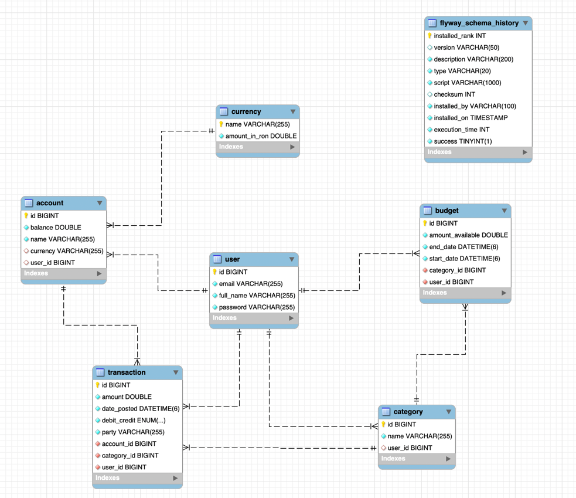
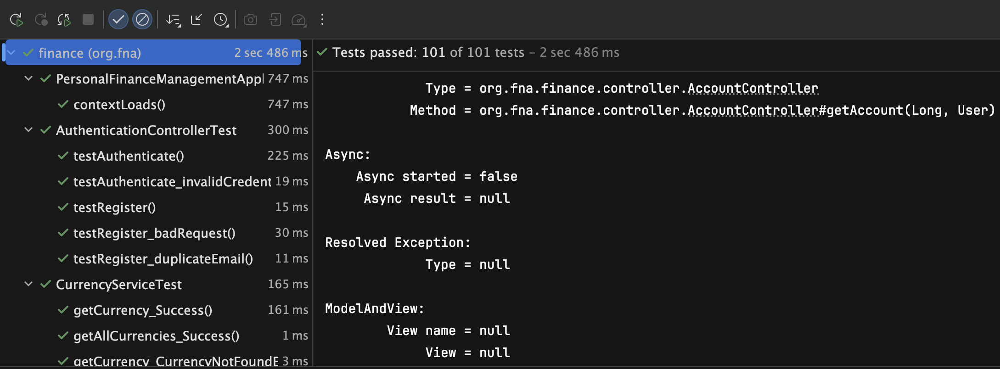

# Spring Boot Personal Finance

## 10 Business Requirements:
    - Users should be able to register or authenticate and receive a token through which they identify
    - Users should only have access to their respective resources (accounts, transactions, categories, budgets)
    - Accounts should be able to handle different currencies
    - Transactions need to belong to a certain account and can be included in a certain category
    - Creating transactions and updating their amounts should alter the available balance of an account
    - Transactions that take the available account balance below 0 should not be able to be created
    - Given a certain transaction, it’s category should be editable separately from its other details (amount, date_posted, etc.)
    - For every category, the user should be able to create a budget which starts automatically on the date it’s created and ends 1 month later
    - Fetching budgets should return the amount_spent computed by summing the debit transactions which belong to the category of the respective budget
    - The transactions used to compute the spent amount of a budget should be posted on a day between the start_date and the end_date of that budget

## MVP Features:
    - Authentication endpoints which return a JWT
    - Secure other endpoints using a JWT filter and fetch all resources only for the user authenticated via the JWT
    - Define a method in TransactionService to compute the difference between an initial and an updated transaction to use for account balance calculation
    - Define Budget model so that startDate and endDate are populated automatically based on the sys_date
    - Define a method in TransactionService to compute the total amount spent on debit transactions given a certain category, start_date and end_date

## Database ERD:
    

## Unit Tests:

### Unit Tests have been written for all service and controller methods
    
